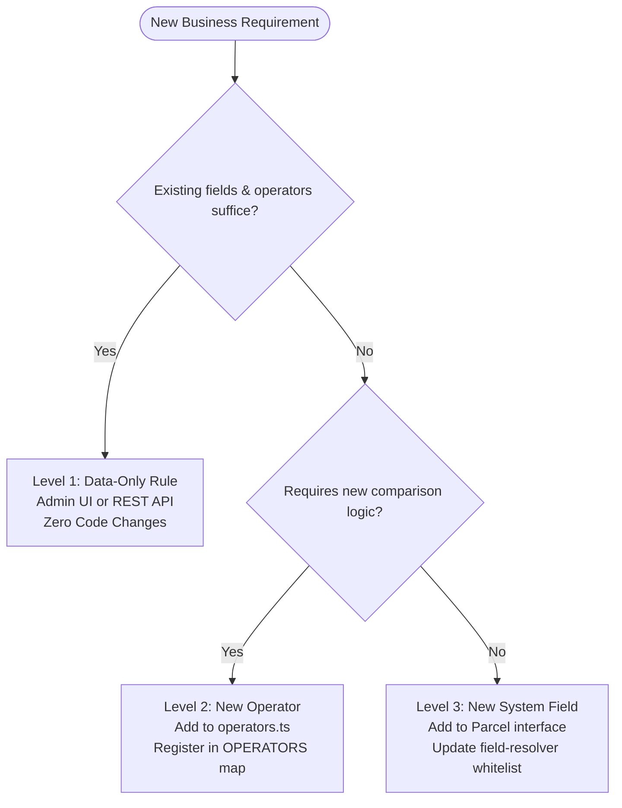

# Parcel Routing System — Technical Architecture & Decisions

This document details the core architectural decisions, engineering trade-offs, extensibility guide, and AI collaboration reflections for the Parcel Routing System.

---

## Table of Contents

1. [Architecture Decisions](#1-architecture-decisions)
   - [Domain Model & Type Layering (`Parcel` vs `ParcelDocument`)](#domain-model--type-layering-parcel-vs-parceldocument)
   - [Field Resolution & Namespace Isolation (`custom.*`)](#field-resolution--namespace-isolation-custom)
   - [Monorepo & Shared Package Strategy (`packages/shared`)](#monorepo--shared-package-strategy-packagesshared)
   - [Pipeline Architecture: Why No Dedicated Message Queue?](#pipeline-architecture-why-no-dedicated-message-queue)
   - [I/O Optimization: Result Buffer & In-Memory Batching](#io-optimization-result-buffer--in-memory-batching)
   - [Execution Model: In-Process vs Worker Threads (Piscina)](#execution-model-in-process-vs-worker-threads-piscina)
   - [Caching Strategy: In-Memory vs Distributed (Redis)](#caching-strategy-in-memory-vs-distributed-redis)
2. [Trade-offs](#2-trade-offs)
3. [How to Extend the System with New Routing Rules](#3-how-to-extend-the-system-with-new-routing-rules)
   - [Level 1: Data-Only Rule Creation (Zero Code Changes)](#level-1-data-only-rule-creation-zero-code-changes)
   - [Level 2: Adding a New Operator](#level-2-adding-a-new-operator)
   - [Level 3: Adding a New Top-Level System Field](#level-3-adding-a-new-top-level-system-field)
4. [AI Usage Documentation](#4-ai-usage-documentation)
   - [Where AI Was Leveraged](#where-ai-was-leveraged)
   - [Critical Modifications & Engineering Corrections](#critical-modifications--engineering-corrections)
   - [Understanding of Generated Architecture](#understanding-of-generated-architecture)
   - [Observed Limitations of AI in Production Systems](#observed-limitations-of-ai-in-production-systems)

---

## 1. Architecture Decisions

### Domain Model & Type Layering (`Parcel` vs `ParcelDocument`)

The domain model enforces a strict architectural boundary between business logic and database persistence:

```
┌────────────────────────────────────────────────────────┐
│                      Parcel                            │
│  (weight, value, destinationCountry, recipient, custom)│
│  Used by: Rule Engine (packages/shared)                │
│  Pure business domain — zero knowledge of DB or HTTP   │
└───────────────────────────▲────────────────────────────┘
                            │ extends
┌───────────────────────────┴────────────────────────────┐
│                  ParcelDocument                        │
│  (_id, status, retryCount, claimedBy, createdAt, ...)  │
│  Used by: API DB Layer (apps/api/src/db/)              │
│  Database persistence & pipeline lifecycle metadata    │
└────────────────────────────────────────────────────────┘
```

#### Why this layering matters:
- **`ParcelDocument` is everything a `Parcel` is, PLUS extra database/pipeline fields.**
- **Pure Business Logic**: The rule engine (`packages/shared/src/rule-engine/`) only operates on `Parcel`. It does not know or care about MongoDB `_id`, timestamps, retry counts, or `status`. 
- **Isolated Testability**: Because the rule engine has zero database dependencies, the entire routing evaluation can be unit tested in-memory in milliseconds without spinning up MongoDB or mocking database clients.
- **Data Encapsulation**: The database layer (`apps/api/src/db/`) handles the storage lifecycle with `ParcelDocument`, while passing only the domain slice to the evaluator.

---

### Field Resolution & Namespace Isolation (`custom.*`)

The rule engine features a dedicated `FieldResolver` (`packages/shared/src/rule-engine/field-resolver.ts`) that enforces strict boundary rules:

1. **Only Allows Known Fields**:
   - Rules can **only** evaluate top-level domain fields: `weight`, `value`, `destinationCountry`, and `recipient`.
   - Rules **cannot** reference internal database or system fields like `_id`, `status`, `claimedBy`, or `retryCount`.
   - Attempting to target internal fields triggers a compile-time and runtime `FieldResolutionError`.

2. **Custom Fields Must Use the `custom.` Prefix**:
   - If an operator tags a parcel with an arbitrary attribute like `fragile: true`, it is stored in `parcel.custom = { fragile: true }`.
   - When building a rule, the field identifier must explicitly be `"custom.fragile"`, not `"fragile"`.
   - **Why this separation matters**: It creates a clear boundary between immutable first-class system fields and dynamic user-defined attributes. Untrusted user attributes cannot shadow or tamper with core billing/routing attributes (e.g., a payload cannot submit `{ custom: { weight: 0.1 } }` to override the real physical weight of 15kg).

---

### Monorepo & Shared Package Strategy (`packages/shared`)

The codebase is organized as an npm workspaces monorepo:
- `packages/shared`: Shared types, domain contracts, validation schemas, and the rule engine.
- `apps/api`: Fastify backend, MongoDB repositories, orchestrator pipeline.
- `apps/web`: React frontend dashboard.

#### How Backend and Frontend Use the Shared Package:
They do not consume the same components. `packages/shared` acts as a toolbox where each application takes only what it needs:

```
packages/shared
├── types/ (ParcelStatus, Document interfaces) ────────┬──> apps/web (Status badges, UI types)
│                                                      └──> apps/api (DB repos, controllers)
├── schemas/ (Zod validation schemas) ────────────────────> apps/api (HTTP request validation)
└── rule-engine/ (RuleEngine, Matcher, Operators) ────────> apps/api (Pipeline evaluation)
```

- **Backend Uses**:
  - The Rule Engine (`RuleEngine`, `RuleMatcher`, `ConditionEvaluator`) to route parcels.
  - Document Types (`ParcelDocument`, `RuleDocument`, `OutcomeDocument`) for database interaction.
  - Zod Schemas (`createParcelSchema`, `createRuleSchema`) for input validation.
- **Frontend Uses**:
  - Shared domain constants and status types (e.g., `PARCEL_STATUS = ['RECEIVED', 'CLAIMED', 'ROUTED', 'PENDING_APPROVAL', 'UNROUTED', 'FAILED', 'REJECTED']`).

#### The Core Benefit: Type Consistency & Drift Prevention
- **Eliminating String Drift**: The backend persists `status: "ROUTED"`. The frontend renders a green badge when `status === "ROUTED"`. With a single shared constant, typos or case discrepancies (like backend writing `"Routed"` while the frontend expects `"ROUTED"`) are caught by the TypeScript compiler.
- **Zero Duplication**: When an engineer adds a new parcel status or field, updating the shared package forces both the API and Web apps to reconcile their contracts immediately.
- **Why the Rule Engine Lives in Shared**: Even though the frontend doesn't evaluate rules today, the engine has zero dependencies on Node.js, HTTP, or databases. Placing it in `packages/shared` decouples it completely from Fastify and MongoDB, enabling future client-side rule simulation or edge execution without any refactoring.

---

### Pipeline Architecture: Why No Dedicated Message Queue?

Instead of provisioning external message broker infrastructure (RabbitMQ, Apache Kafka, AWS SQS), the system uses an atomic **claim-based pipeline** inside MongoDB.

#### Why a dedicated queue was not chosen:
- **Single Server Architecture**: The project runs as a single server instance. The primary architectural benefit of an external message queue—distributing messages across dozens of horizontally scaled, decoupled worker nodes—would not be realized on a single instance.
- **Zero Operational Overhead**: Running RabbitMQ or Kafka requires running, monitoring, clustering, securing, and backing up an entirely separate stateful service.
- **Atomic Concurrency Guarantee**: MongoDB's native atomic `findOneAndUpdate` with query `{ status: "RECEIVED" }` and update `{ $set: { status: "CLAIMED", claimedBy: workerId, claimedAt: new Date() } }` guarantees that exactly one worker claims a parcel, providing exactly-once semantics without distributed lock managers.
- **Built-in Crash Recovery**: If a worker or server crashes mid-flight, the orchestrator runs a periodic stale claim recovery check (`recoverStaleClaims()`), resetting claims older than 60 seconds back to `RECEIVED`.

---

### I/O Optimization: Result Buffer & In-Memory Batching

Database roundtrips are the primary performance bottleneck in I/O systems. Updating parcel statuses and writing outcome audit records one by one would severely limit throughput.

The system uses an in-memory **Result Buffer** (`apps/api/src/pipeline/result-buffer.ts`) to batch MongoDB operations into efficient `bulkWrite` commands.

```
Individual Parcel Evaluated
          │
          ▼
   [ Result Buffer ]  (accumulates in memory)
          │
    Flushes when:
    ├── 1. Buffer reaches capacity (50 items)  → "Cart is full, checkout now"
    └── 2. Timer expires (5 seconds)          → "Don't wait forever, flush current items"
          │
          ▼
   MongoDB bulkWrite()  (1 single network trip for 50 records)
```

#### What happens if the server crashes before a flush?
- **The Risk**: Any routing results sitting in memory that have not yet been flushed to the `outcomes` collection are lost.
- **The Safety Mechanism**: Because the database write has not executed, the affected parcels remain in the `CLAIMED` status in MongoDB.
- **Self-Healing**: When the server restarts, the orchestrator's stale claim recovery process detects parcels that have been stuck in `CLAIMED` status for over 60 seconds and resets them to `RECEIVED`.
- **Result**: No permanent data loss occurs. The parcels are simply picked up on the next tick and re-evaluated.

---

### Execution Model: In-Process vs Worker Threads (Piscina)

The project includes `piscina` as a dependency, and the worker module (`apps/api/src/pipeline/worker.ts`) is designed as a pure, stateless compute function. However, the runtime intentionally executes the worker pool **in-process on the main Node.js event loop** rather than spawning physical worker threads.

#### Technical Rationale:
1. **Rule Evaluation is NOT CPU-Bound**:
   - Evaluating 4 or 5 condition rules on a parcel takes **less than 0.05 milliseconds** (50 microseconds) of memory operations.
   - Node.js worker threads are designed for heavy CPU tasks (e.g., image manipulation, cryptography, ML models). Offloading microsecond-level checks to a separate thread is unnecessary.
2. **Cross-Thread Transfer Overhead**:
   - Passing data between Node.js worker threads requires `postMessage` with structured cloning (serializing and deserializing objects across V8 memory isolates).
   - This IPC transfer overhead takes approximately **0.5ms to 1.0ms**—making thread delegation **10x to 20x slower** than evaluating the rule directly on the main event loop.
3. **Database I/O is the Actual Bottleneck**:
   - 99% of processing time is spent awaiting MongoDB queries. Node.js handles asynchronous I/O natively with high efficiency via `libuv`.
4. **Tooling & Development Simplicity**:
   - Spawning worker threads with TypeScript in development (`tsx`) requires custom loaders or pre-compiling workers to physical JavaScript files on disk. An in-process executor provides instant startup with zero build-step fragility.
5. **Future Extensibility (Dependency Injection)**:
   - The orchestrator depends on the abstract `WorkerPool` interface (`{ run(input): Promise<output>, destroy(): Promise<void> }`). If the business later introduces heavy computation (e.g., 3D bin-packing or route graph algorithms), switching to real multi-threaded Piscina workers requires changing only 3 lines of instantiation code.

---

### Caching Strategy: In-Memory vs Distributed (Redis)

Rule lookups are cached **in-memory** within the Node.js process.

#### Why In-Memory?
- **Single Process Efficiency**: In a single-instance deployment, in-memory lookups have zero network latency (sub-microsecond access vs 1–3ms over Redis network sockets).
- **Infrequent Changes**: Routing rules are changed infrequently (a few times per day by admins). When a rule is created or updated, the orchestrator immediately invalidates its internal cache on the next tick.

#### When would you introduce Redis?
- **Multi-Instance Scaling**: If the API is horizontally scaled to multiple instances behind an Application Load Balancer, an admin updating a rule on Instance A would leave Instances B and C with stale local caches.
- In that scenario, Redis would serve as a centralized cache with Pub/Sub invalidation events notifying all instances when rule revisions occur. For a single server, adding Redis introduces operational baggage without practical benefit.

---

## 2. Trade-offs

| Decision | Chosen Approach | Alternative Considered | Primary Benefit | Trade-off / Cost |
| :--- | :--- | :--- | :--- | :--- |
| **Pipeline Ingestion** | MongoDB Atomic Claims (`findOneAndUpdate`) | Message Broker (RabbitMQ, SQS, Kafka) | Zero extra infrastructure; transactional consistency within one database. | Throughput is bounded by MongoDB write capacity; cannot easily partition work across separate worker clusters. |
| **Result Persistence** | In-Memory Batched Buffer (`bulkWrite`) | Immediate Synchronous Writes | Drastically reduces DB roundtrips and connection pool pressure. | Unflushed memory results can be lost during an ungraceful crash (mitigated by stale claim recovery). |
| **Rule Execution** | In-Process Event Loop Evaluation | Worker Threads (`piscina` thread pool) | Zero serialization overhead; 10x faster execution; seamless TypeScript dev experience. | A malicious or poorly written rule with infinite loops would block the event loop. |
| **Rule Caching** | Local In-Memory Cache | Distributed Cache (Redis) | Sub-microsecond read latency; zero network overhead or external services. | Cannot coordinate cache invalidation across multiple horizontal server nodes without shared pub/sub. |
| **Priority Handling** | Cascade Auto-Shift on Collision | Strict Rejection (HTTP 409 Conflict) | Frictionless operator UX; allows inserting rules directly into desired precedence slots. | Implicitly modifies priorities of existing rules below the insertion point; requires administrative awareness. |
| **Client Synchronization** | HTTP Polling (2-second interval) | WebSockets / Server-Sent Events (SSE) | Stateless, firewall/proxy friendly; automatic reconnection with zero heartbeat management. | Up to 2 seconds of latency before UI reflects backend state changes; continuous HTTP traffic. |
| **Batch File Parsing** | Streaming SAXes (XML) & JSON Stream | Full DOM / In-Memory Array Parsers | Constant memory footprint regardless of file size; structurally immune to XML External Entity (XXE) attacks. | Parser code requires complex state machine handling; harder to write and maintain than `JSON.parse`. |

---

## 3. How to Extend the System with New Routing Rules

The routing engine supports three distinct extension pathways depending on the nature of the business requirement:



---

### Level 1: Data-Only Rule Creation (Zero Code Changes)

If the new rule uses existing top-level fields (`weight`, `value`, `destinationCountry`, `recipient`) or any user-defined attribute (`custom.*`) along with existing operators (`eq`, `neq`, `>`, `>=`, `<`, `<=`, `in`, `not_in`), **no code changes or deployments are needed**.

#### Example: Routing Fragile Items
1. Warehouse operators tag incoming parcels with `custom.fragile: "true"`.
2. Admin logs into the Web Dashboard $\rightarrow$ **Rules Management** $\rightarrow$ **+ New Rule**.
3. Configure the rule:
   - **Name**: `Fragile Goods Special Handling`
   - **Priority**: `1` (Automatically shifts existing rules down by 1 position)
   - **Condition**: Field: `custom.fragile` | Operator: `eq` | Value: `"true"`
   - **Action**: Route to `Fragile Department`
4. On the next tick, the orchestrator invalidates its cache and immediately applies the new rule.

---

### Level 2: Adding a New Operator

When business logic requires a new type of comparison (e.g., regex matching, substring containment, prefix checking).

1. **Implement the Comparator** in `packages/shared/src/rule-engine/operators.ts`:
   ```typescript
   export function startsWithOperator(actual: unknown, expected: unknown): boolean {
     if (typeof actual !== 'string' || typeof expected !== 'string') return false;
     return actual.startsWith(expected);
   }
   ```
2. **Register in the Operator Map**:
   ```typescript
   export const OPERATORS: Record<string, OperatorFunction> = {
     // ... existing operators
     starts_with: startsWithOperator,
   };
   ```
3. **Add Unit Tests** in `packages/shared/test/operators.test.ts`.
4. The operator is now instantly available in rule definitions across both backend and UI.

---

### Level 3: Adding a New Top-Level System Field

When an attribute is deemed a permanent first-class entity across all parcels (e.g., `originWarehouse`).

1. **Update Domain Interface** in `packages/shared/src/rule-engine/types.ts`:
   ```typescript
   export interface Parcel {
     weight: number;
     value: number;
     destinationCountry: string;
     recipient: Recipient;
     originWarehouse?: string; // New top-level field
     custom?: Record<string, unknown>;
   }
   ```
2. **Whitelist in Field Resolver** in `packages/shared/src/rule-engine/field-resolver.ts`:
   ```typescript
   const KNOWN_TOP_LEVEL_FIELDS = new Set([
     'weight',
     'value',
     'destinationCountry',
     'recipient',
     'originWarehouse', // Allows rule conditions to reference this field directly
   ]);
   ```
3. **Update Schemas & UI Form**:
   - Update Zod validation in `packages/shared/src/schemas/parcel.ts`.
   - Add input field in `apps/web/src/pages/ParcelForm.tsx`.

---

## 4. AI Usage Documentation

AI tools (Anthropic Claude and Google Gemini) were utilized as pair-programming assistants throughout the development of the system. In accordance with professional engineering standards, all generated code and architectural patterns were critically reviewed, vetted, and modified.

To take a look at the prompts used throughout development, go to the [Prompts folder](./Prompts).

---

### Where AI Was Leveraged

1. **Boilerplate & Parser Scaffolding**:
   - Generating the initial streaming SAXes XML parser state machine (`xml-stream-parser.ts`).
   - Drafting Sentry OpenTelemetry and custom metric integration wrappers (`sentry.ts`, `metrics.ts`).
2. **Test Matrix Synthesis**:
   - Formulating edge-case test matrices for the rule engine (e.g., handling null prototypes, mixed numeric type comparisons, deep object traversal).
   - Drafting concurrent race-condition tests (e.g., 10 simultaneous workers attempting to claim a single parcel).
3. **Statistical Modeling**:
   - Deriving the two-sample proportion Z-score algorithm for the automated routing drift detector (`drift.ts`).

---

### Critical Modifications & Engineering Corrections

Several initial AI recommendations were rejected or significantly restructured based on human engineering judgment:

1. **Field Resolution & Namespace Security**:
   - *AI Proposal*: The AI generated a dynamic dot-path evaluator using generic `lodash.get`-style resolution over the entire parcel object.
   - *Engineering Correction*: This was rejected due to a critical security vulnerability: it allowed incoming parcel payloads with malicious custom metadata (e.g., `{ custom: { weight: 0.5 } }` or `{ custom: { _id: "admin" } }`) to shadow or access internal system attributes.
   - *Implementation*: Replaced with strict namespace isolation: top-level fields are strictly whitelisted, and dynamic user fields are enforced under `custom.*`.

2. **Priority Conflict Strategy**:
   - *AI Proposal*: The AI originally implemented a strict uniqueness validation on rule priorities, throwing an HTTP 409 Conflict if an admin attempted to create a rule with an existing priority number.
   - *Engineering Correction*: This caused severe administrative friction. Reordering rules required deleting and recreating multiple rules manually.
   - *Implementation*: Replaced with an atomic descending priority cascade auto-shift (`rule-repository.ts`), allowing seamless insertion of rules at any position.

3. **XML Parser Selection & XXE Vulnerability**:
   - *AI Proposal*: The AI initially suggested using `fast-xml-parser` with default DOM parsing options.
   - *Engineering Correction*: DOM parsing creates memory spikes on multi-megabyte batch uploads and introduces XML External Entity (XXE) risks.
   - *Implementation*: Switched to the streaming `saxes` parser, which does not expand external entities or DTDs by default, structurally eliminating XXE attacks and keeping memory usage constant.

4. **Premature Multi-Threading (Piscina)**:
   - *AI Proposal*: The AI attempted to wire all parcel evaluations through a Piscina worker thread pool immediately at server startup.
   - *Engineering Correction*: Benchmarks showed that serializing tiny parcel objects across thread boundaries took ~1ms, whereas in-memory evaluation took <0.05ms. Threading was making the system slower while adding TypeScript build complexity.
   - *Implementation*: Retained the decoupled `WorkerPool` interface for architectural extensibility, but implemented the runtime as an inline in-process pool.

---

### Understanding of Generated Architecture

Full ownership and comprehension of the codebase is maintained across all components:

- **Atomic State Transitions**: Understanding why `{ status: "RECEIVED" }` inside MongoDB's `findOneAndUpdate` acts as a CAS (Compare-And-Swap) lock, preventing distributed duplicate processing without Redis Redlock.
- **Drift Detection Math**: Understanding why the Z-score calculation requires a minimum sample threshold ($n \ge 30$) to prevent false-positive alerts on low-volume routing shifts.
- **Reverse Priority Updates**: Understanding why priority cascade shifting must iterate in descending order (`order: -1`) when updating MongoDB documents under a unique compound index (`{ priority: 1, active: true }`) to avoid transient unique constraint collisions.

---

### Observed Limitations of AI in Production Systems

1. **Over-Engineering Bias**: AI models consistently propose enterprise distributed systems (Kafka, Redis, RabbitMQ, Microservices) for scenarios where single-process patterns with reliable database primitives are significantly more robust, cost-effective, and maintainable.
2. **Security & Namespace Blind Spots**: AI models focus primarily on making functional happy-paths work (e.g., resolving nested fields) while missing secondary boundary threats like field shadowing, prototype pollution, and XXE injection.
3. **UX & Workflow Disconnect**: AI favors strict mathematical correctness (rejecting priority overlaps with 409 errors) over pragmatic operational ergonomics (auto-shifting priorities to facilitate user intent).
